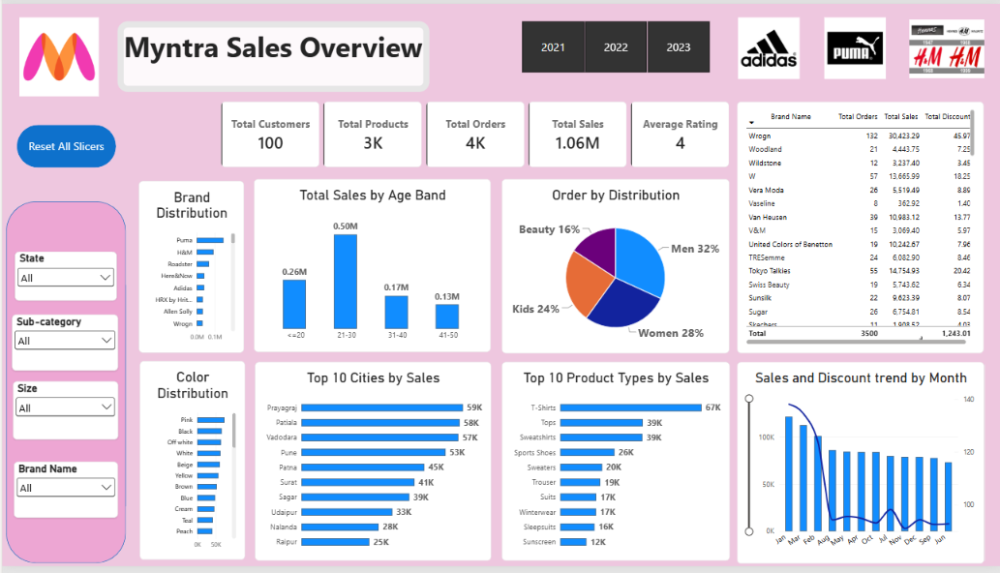

# Myntra Sales Analysis | Power BI Dashboard

## 📊 Project Overview

This project presents an interactive Power BI dashboard developed to analyze Myntra sales data and understand sales performance, customer behavior, product performance, and monthly sales trends.

The dashboard provides an interactive view of key business metrics using KPIs, charts, slicers, and drill-down analysis.

## 🎯 Objectives

- Analyze overall sales performance
- Identify top-performing product types
- Analyze sales distribution across cities
- Understand customer age-group contribution
- Analyze order distribution by category
- Analyze brand and color distribution
- Track monthly sales and discount trends
- Provide an interactive dashboard for business analysis

## 🛠️ Tools & Technologies

- Power BI
- Power Query
- DAX
- Excel
- Data Modeling
- Data Analysis

## 📌 Dashboard Features

### Sales Overview
- Total Customers
- Total Products
- Total Orders
- Total Sales
- Average Rating
- Year-based filtering
- State, Sub-category, Size and Brand filters

### Visualizations

- Brand Distribution
- Color Distribution
- Sales by Age Band
- Order Distribution by Category
- Top 10 Cities by Sales
- Top 10 Product Types by Sales
- Monthly Sales & Discount Trend
- Brand-wise Sales and Order Analysis

## 📈 Key Insights

- The 21–30 age group contributes the highest sales.
- Men have the highest order distribution among the available categories.
- T-Shirts are the top-performing product type by sales.
- Major cities contribute a significant portion of overall sales.
- Sales and discount patterns vary across months.

## 📅 Dataset

The dataset contains sales/order information covering **2021 to March 2023**.

## 🔄 Data Preparation

The data was prepared using Power Query, including:

- Data cleaning
- Data type correction
- Handling data quality issues
- Data transformation
- Relationship creation
- Data modeling

## 🧮 DAX Measures

```DAX
Total Orders =
DISTINCTCOUNT(fact_orders[Order ID])
````

```DAX
Total Customers =
DISTINCTCOUNT(fact_orders[Customer ID])
```

```DAX
Total Sales =
[Total Original Sales] - [Total Discount]
```

```DAX
Average Order Value =
DIVIDE(
    [Total Sales],
    [Total Orders]
)
```

## 📷 Dashboard Preview



## 💡 Skills Demonstrated

* Data Cleaning & Transformation
* Power BI Dashboard Development
* DAX
* Data Modeling
* KPI Development
* Business Analysis
* Data Visualization
* Interactive Reporting

## 👤 Author

**Jaydev Chole**

M.Sc. Data Science | Data Analyst

📍 Pune, Maharashtra, India

[LinkedIn](https://www.linkedin.com/in/jaydev-chole-b3313b327/)

````
````

**Important:** README mein `2024–2026 Myntra data` mat likhna. Tumhare current dataset ke according **2021–March 2023** hi correct hai.

Aur GitHub par dataset upload karne se pehle uske **source/license** ko check kar lena. Publicly available hona automatically unrestricted reuse ka permission nahi hota.
